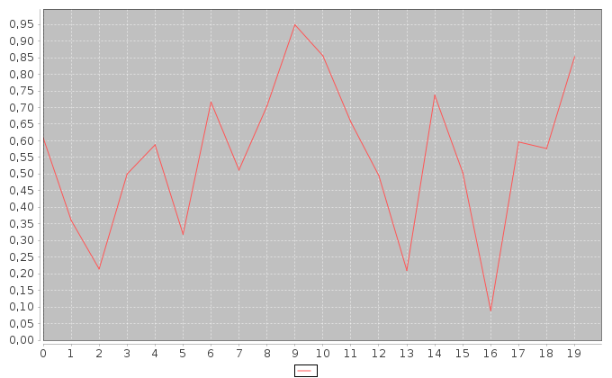

# Naloge v devetem tednu

V devetem tednu se boste lotili streaminga twitterja in nekaterih osnovnih analiz twitter toka.

## Priprava terena

 1. Ustvarite si twitter račun (če ga še nimate)
 2. Pojdite na https://dev.twitter.com/apps in se prijavite v svoj TW račun
 3. Kliknite na "Create new application"
 4. Izpolnite formo (za spletno stran lahko date nekaj poljubnega)
 5. V zavihku "API Keys"  kliknite na "Create my access token."

Tako boste dobili 4 "ključe", ki jih boste potrebovali za nalogo.
V datoteki Main.scala (v razredu TweetStreamer) na štiri mesta skopirajte ustrezne ključe.
*Pred oddajo na učilnico pa te ključe obvezno pobrišite.*

Kot primer ene aplikacije imate implementiran razred 'NalogaDemo', ki ga v sbt-ju zaženete z:
```
run-main NalogaDemo
```
Ta razred naj vam služi kot kalup za implementacijo nalog. Za vsako nalogo boste implementirali en tak "izvršljiv" objekt. Funkcionalnost pa boste v vsaki nalogi implementirali z razredom, ki bo razširjal 'TweetManipulator' - za demo nalogo je to 'TrivialManipulator', ki vsak tweet preprosto izpiše.

## Logika TweetManipulator-ja

Tokrat se bomo oddaljili od "čistosti" funkcijskega programiranja in se umazali z dejanskimi spremenljivimi podatki v Scali. Zato predstavlja TweetManipulator nekakšen filter toka tweetov.
En manipulator ima dve glavni funkciji (ki sta tipa Unit - torej ne vračata ničesar).

```scala
trait TweetManipulator {
  def process(tweet: String)
  def outputFinal
}
```
Funkcija 'process' je odgovorna za obdelavo enega tweeta, ki ji je podan kot argument, ob zaključku procesiranja toka podatkov pa se pokliče funkcija outputFinal, ki je odgovorna za izpis kakšnih statistik ali

## Naloga 1.

 Napišite manipulator, ki bo imel implementirano funkcijo
 ```scala
 def isEnglish(tweet:List[String]):Boolean
 ```
 ki vzame seznam besed (seznam besed iz enega tweeta) in vrne true, če je več kot 50% besed iz angleškega jezika in false sicer.

 V direktoriju 'resources' imate datoteko 'wordsEn.txt', ki vsebuje vse (no, mogoče ne vseh) angleške besede. Te besede preberite kot seznam in ga uporabite znotraj funkcije.

Branje datoteke implementirajte s pomočjo razreda Source. Nekaj navodil in primerov uporabe tega razreda in branja iz datotek najdete na:
http://www.tutorialspoint.com/scala/scala_file_io.htm

In še specifikacija objekta Source:
http://www.scala-lang.org/api/2.11.5/index.html#scala.io.Source$

V funkciji *process*  izpišite samo tiste tweete, ki so po zgornjem kriteriju označene kot angleški.
Funkcija *outputFinal* pa naj izpiše delež angleških tweetov v sprocesiranem tweeter toku.

## Naloga 2.

Napišite manipulator, ki bo zbiral frekvence pojavnosti besed v toku angleških tweetov.

Po končanju procesiranja pa naj izpiše 100 najpogostejših besed v toku tweetov v zadnjih petih minutah.
Vodite evidenco samo o tistih besedah, ki niso med najpogostejšimi v angleškem jeziku in so dolge vsaj 3 znake. Ponovno je v direktoriju 'resources' datoteka 'commonEng.txt', v kateri so shranjene najpogostejše besede v angleškem jeziku. Teh besed ne štejte v frekvenci.

V manipulatorju implementirajte funkciji
```scala
def isCommon(w: String):Boolean
```
ki vrne true, če je to ena izmed pogostih angleških besed in funkcijo

```scala
def mostCommon(l: List[String]):List[(String, Int)]
```
ki iz podanega seznama besed vrne 100 najpogostejših - seveda brez najpogostejših besed- urejenih po frekvenci, od najbolj pogoste do najredkejše. Poleg same besede naj vrne tudi število pojavitev te besede v seznamu.

Funkcija *process* naj  tweete zbira, funkcija *outputFinal* pa naj zbrane tweete obdela in izpiše 100 najpogostejših, urejene po frekvenci. Poleg same besede naj izpiše tudi število pojavitev.

## Naloga 3. :crown:

Napišite manipulator, ki bo meril trenutno vzdušje na Tweeterju.

Določene besede nosijo čustven naboj, nekatere pozitiven, nekate pa negativnega. Te besede zelo zaznamujejo celoten stavek, zato lahko z detekcijo takih besed detektiramo vzdušje nekega besedila. Na tak način lahko izračunamo čustven naboj posameznih tweetov in kumulativen naboj vseh tweetov v nekem časovnem obdobju predstavlja "vzdušje celotnega sveta". Takemu izračunu se bolj pompozno reče *sentiment analysis*.

 V direktoriju 'resources' imate datoteko 'sentiment.txt', ki hrani seznam angleških besed, poleg vsake pa je podan še njen sentiment (negativne vrednosti so negativne besede, pozitivne vrednosti so pozitivne besede). Če besede ni v tem seznamu, potem je to nevtralna beseda in ima sentiment 0. Sentiment enega tweeta je določen z vsoto sentimentov posameznih besed.

Napišite funkcijo
```scala
def sentimentValue(tweet: List[String]):Int
```

ki iz podanega tweeta naračuna njegov sentiment.

Npr. tweet:
```
Go to hell, loser!!!
```
ima zelo negativen sentiment, -7: besedi *go* in *to* sta nevtralni, *hell* ima vrednost *-4*, *loser* pa *-3*.

V ustreznem manipulatorju nato implementirajte kumulativno zbiranje sentimenta in možnost izpisa povprečnega sentimenta (kot Double).

V funkciji *main* (objekta Naloga3) nato uporabite ta manipulator, da vsako minuto zbere sentiment Twitterja in izpiše povprečen sentiment v tej minuti.

S pomočjo knjižnice [scala-chart](https://github.com/wookietreiber/scala-chart)  narišite graf povprečnega sentimenta (minutnega) v eni uri. Knjižnica vam je že na voljo, preberite si zgolj dokumentacijo, kako ustvarite enostaven XY graf.
Generirajte png in ga oddajte na učilnici poleg izvorne kode in testov.

Zelo enostaven primer takega grafa (za 20 minut) bi bil npr.

